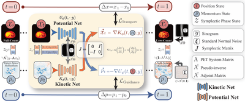
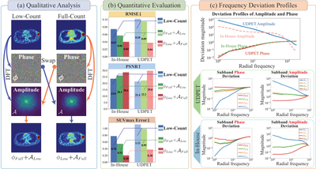
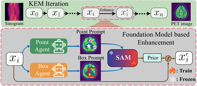








# Zhang Zheng (张政)

# About Me

I am a Ph.D. student at [The Hong Kong Polytechnic University](https://www.polyu.edu.hk/), advised by [Prof. Jing Qin](https://research.polyu.edu.hk/en/persons/jing-qin/). My research focuses on medical AI, medical imaging, brain-computer interfaces, and generative artificial intelligence for healthcare applications.

Before joining PolyU, I was a Research Assistant at [SIAT, CAS](https://www.siat.ac.cn/), under the supervision of [Prof. Zhanli Hu](https://people.ucas.ac.cn/~huzhanli).

Prior to that, I received my M.S. in Biomedical Engineering from [Imperial College London](https://www.imperial.ac.uk/), advised by [Prof. Mengxing Tang](https://profiles.imperial.ac.uk/mengxing.tang). I received my B.S. from the [University of Nottingham](https://www.nottingham.ac.uk/).

You can find my CV here: [Zhang Zheng's Curriculum Vitae](../Research_CV_ZhengZhang.pdf). Feel free to reach out via [email](mailto:zheng1.zhang@connect.polyu.hk).

# 🔥 News
- *2026.04*: &nbsp;🎉🎉 **FlowPET** accepted at **ICML 2026**.
- *2025.11*: &nbsp;🎉🎉 **FourierPET** accepted at **AAAI 2026 (Oral Presentation)**.
- *2024.08*: &nbsp;One paper accepted at **IEEE Transactions on Medical Imaging**.

# 📝 Publications

  

    
  

  

    
<a href="https://arxiv.org/abs/2607.11104">FlowPET: Physics-Informed Symplectic Flow Matching for Low-Count PET Reconstruction</a>

    
<strong>Zhang Zheng</strong>, H Tang, Y Hu, Z Hu, Jing Qin

    
ICML, 2026

    
<a href="https://arxiv.org/abs/2607.11104">paper</a> <a href="https://github.com/xiaochaorouz/FlowPET">code</a>

  

  

    
  

  

    
<a href="https://arxiv.org/abs/2601.11680">FourierPET: Deep Fourier-based Unrolled Network for Low-count PET Reconstruction</a>

    
<strong>Zhang Zheng</strong>, H Tang, Y Hu, Z Hu, Jing Qin

    
AAAI, 2026 &nbsp;Oral Presentation

    
<a href="https://arxiv.org/abs/2601.11680">paper</a> <a href="https://github.com/xiaochaorouz/FourierPET">code</a>

  

  

    
  

  

    
<a href="https://ieeexplore.ieee.org/abstract/document/10833823">Prompt-Agent-Driven Integration of Foundation Model Priors for Low-Count PET Reconstruction</a>

    
X Xie, W Zhao, M Nan, <strong>Zhang Zheng</strong>, Y Wu, H Zheng, D Liang, M Wang, Z Hu

    
IEEE Transactions on Medical Imaging

    
<a href="https://ieeexplore.ieee.org/abstract/document/10833823">paper</a>

  

# 📖 Educations
- *2025 – present*, Ph.D. Student, [The Hong Kong Polytechnic University](https://www.polyu.edu.hk/), Hong Kong, China
  - Advised by [Prof. Jing Qin](https://research.polyu.edu.hk/en/persons/jing-qin/)
- *2023 – 2025*, Research Assistant, [Shenzhen Institutes of Advanced Technology, CAS](https://www.siat.ac.cn/), Shenzhen, China
  - Advised by [Prof. Zhanli Hu](https://people.ucas.ac.cn/~huzhanli)
- *2021 – 2022*, M.S. in Biomedical Engineering, [Imperial College London](https://www.imperial.ac.uk/), London, UK
  - Advised by [Prof. Mengxing Tang](https://profiles.imperial.ac.uk/mengxing.tang)
- *2017 – 2021*, B.S. in [University of Nottingham](https://www.nottingham.ac.uk/), Nottingham, UK

------

  <i>Zhang Zheng | The Hong Kong Polytechnic University</i>

